# NewEyes - Smart glasses for blind people :eyeglasses:
:pushpin: Smart glasses, comprised of a processing unit, a pair of glasses and
a high quality 16Mpx camera. The target group of the product are the blind and 
visually impaired people.  
:pushpin: The gadget is controlled by buttons, voice commands and hand gestures 
with which the user can easily activate the different functionalities
without almost any effort.
      

# Share your opinion! :trophy:
Give a :star: if you like the project! 
  
  

# License :scroll:
This project is licensed under the MIT License - Check out the 
<a href="https://github.com/IvanCvetkov/NewEyes/blob/main/LICENSE">LICENSE</a> for more details.
   

# Author :nerd_face:

Ivan Cvetkov   
&emsp;• Username: gonogo, E-mail: i.tsvetkovbg@gmail.com
   

# Examples :round_pushpin:

## Screenshots 

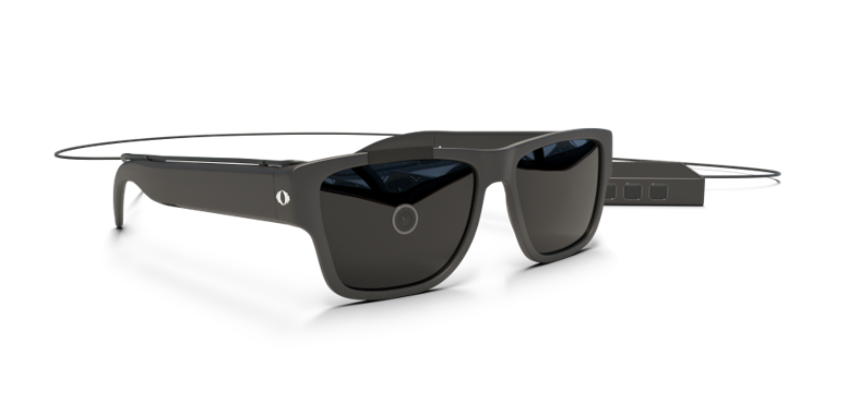

  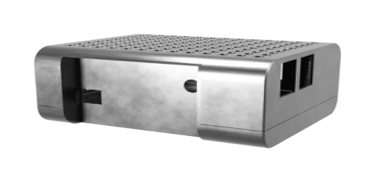
  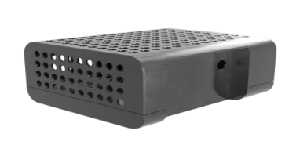 

   

## Product Design

  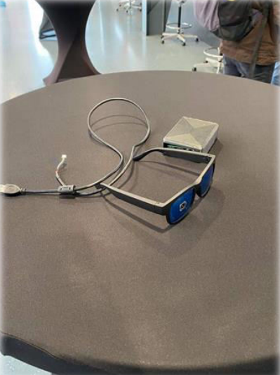
  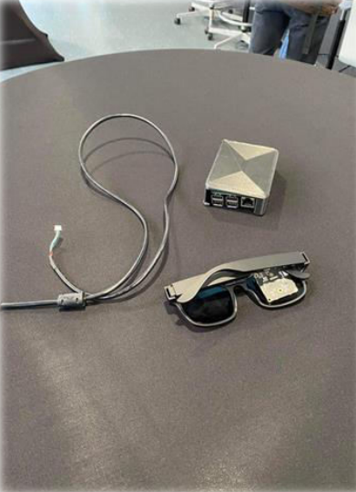 

   

# Text reading in bulgarian and english  
(Disclaimer: The orientation of the text is of no importance, the software
detects the wrong orientation and aligns the text properly)

## Printed Text Reading
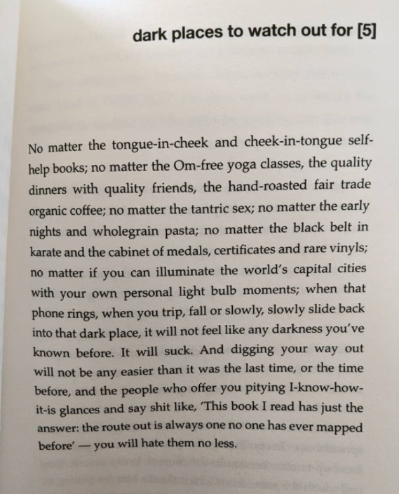
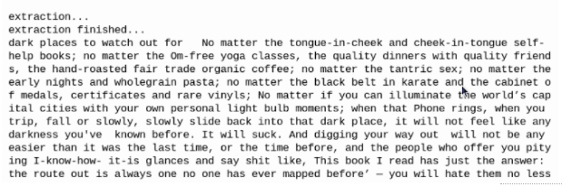

  

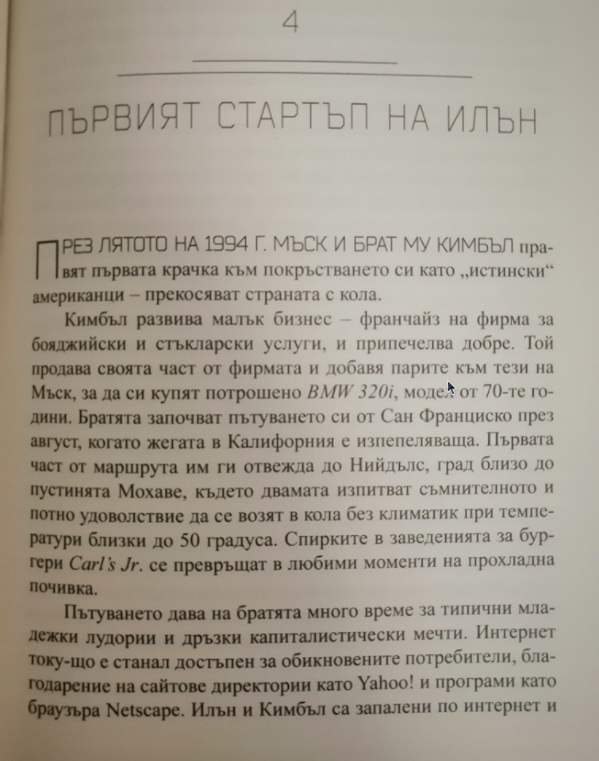
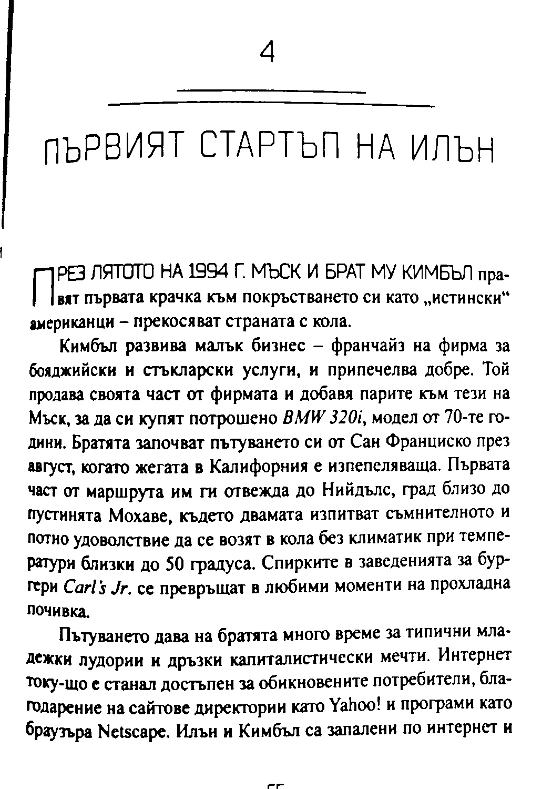
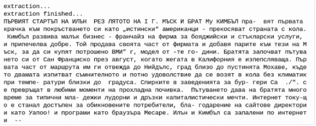

  

## Example of fixing wrong text orientation
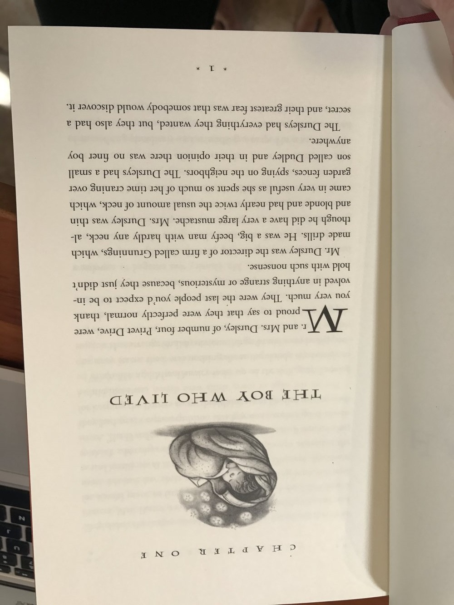
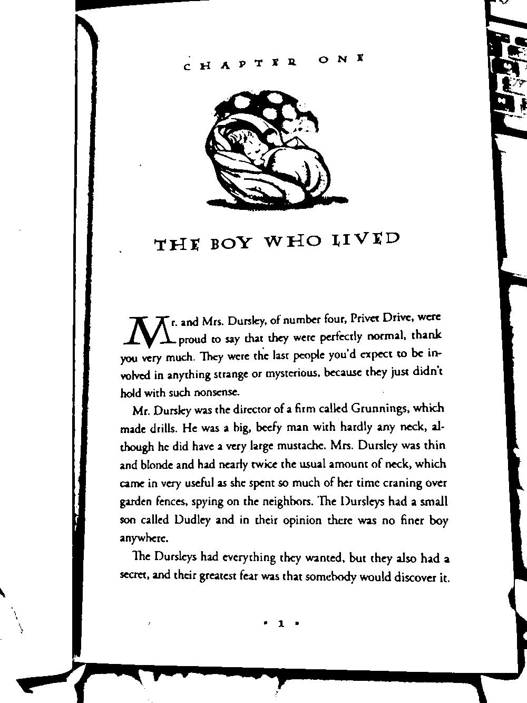
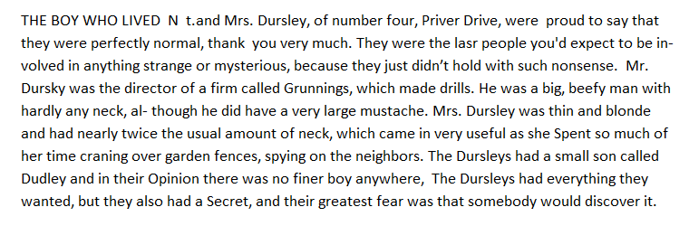

  

## Text reading in an unusual environment
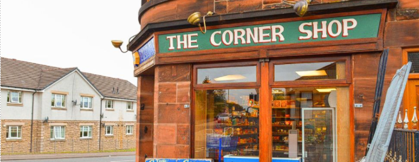
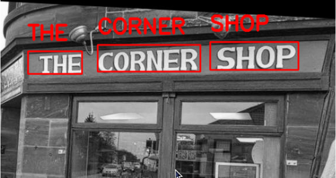
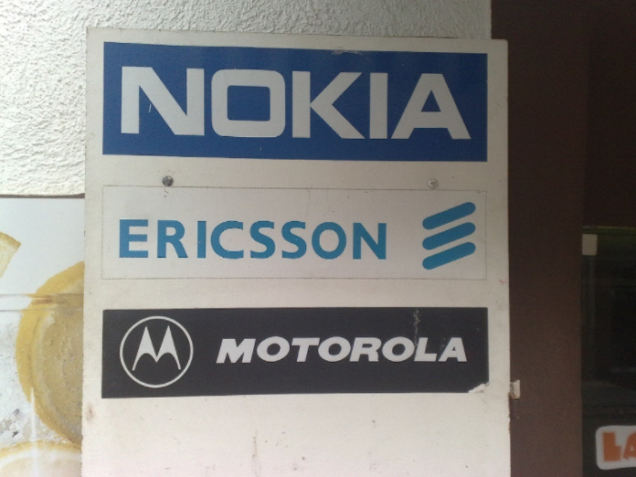
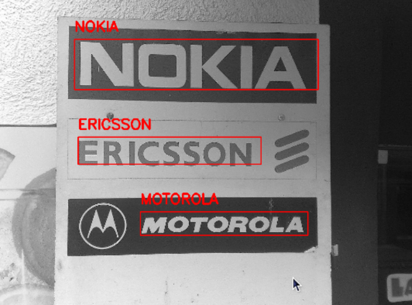

  

## Receipt scanning
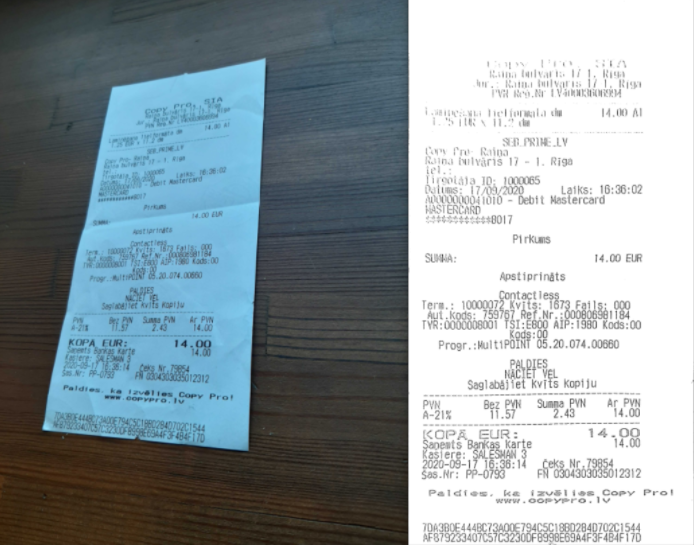
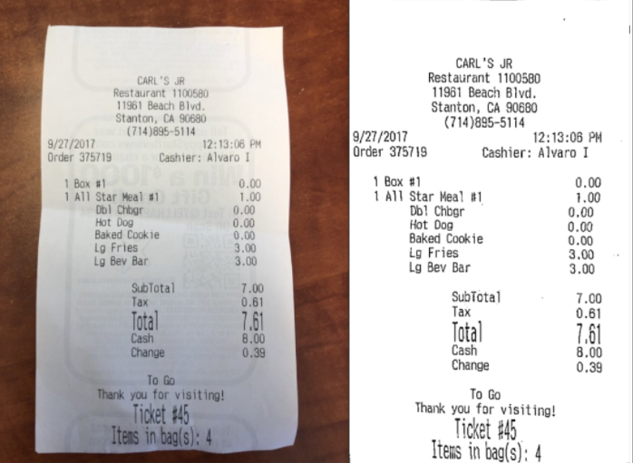
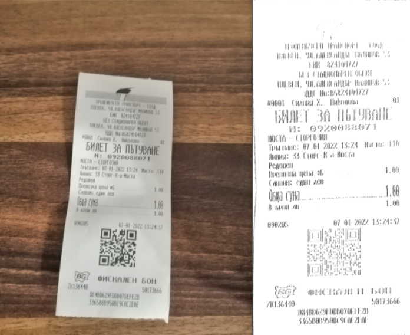

      

## Object recognition and their position (left, right, up, down)
After the processing stage, the recognition of the object and the translation to bulgarian language (if necessary) 
are completed, the device speaks out the contents of the image (objects and their position in 3D space) through
the embedded in the glasses's frame speakers, or through connected to the device headphones.
This way the blind person can receive valuable key information about the surrounding environment and help him with
orientation in one such unusual environment.  

 

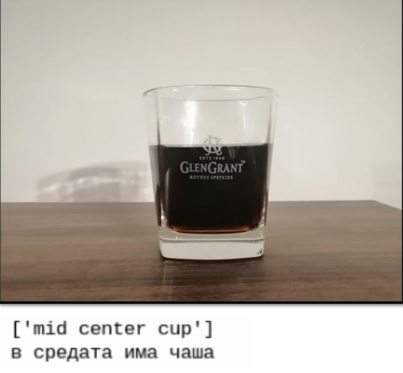

 

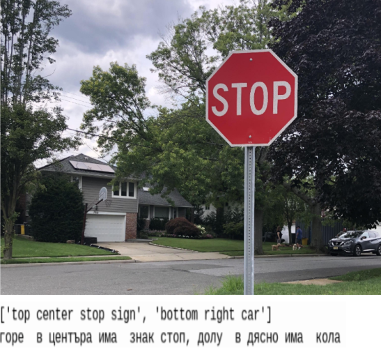

      

## Interactive help from another person (Acquaintance/Friend/Family) through the camera  

The functionality is comprised of a videochat, through which
the blind person is navigated by another person, who is remotely
accessing the glasses's camera. That way, the blind person
could easily do tasks that otherwise require the navigator/assistant
being there physically, which is not always possible.
The remote connection and videochat uses the platform Duo, which
offers simple call by number functionality, making the functionality
much easier to use.

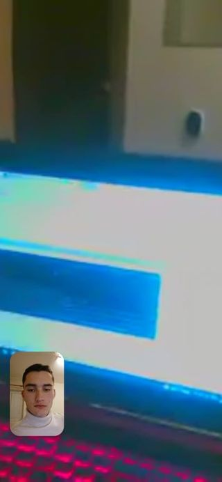

      

## Color Recognition in bulgarian
https://user-images.githubusercontent.com/97058791/152701536-6b37c342-0eb0-4af8-9801-c10c8d0b1d24.mp4

      

## Barcode & QR code scanner 
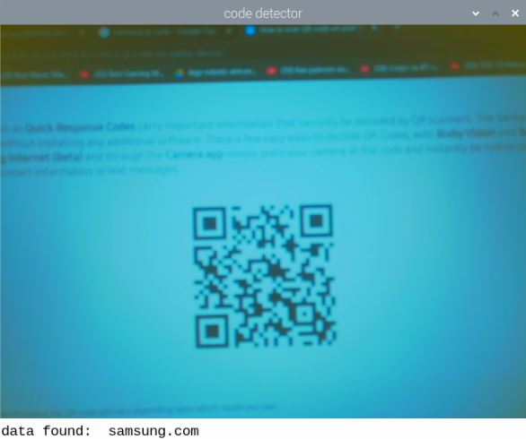

      

## Awards
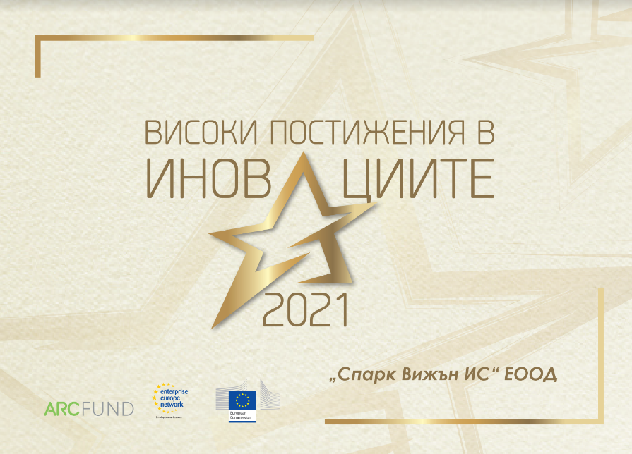
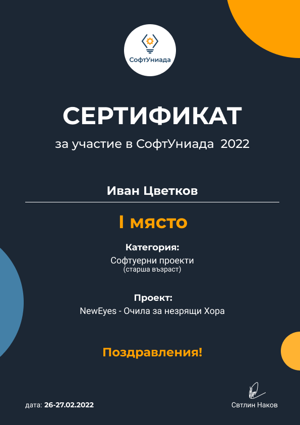